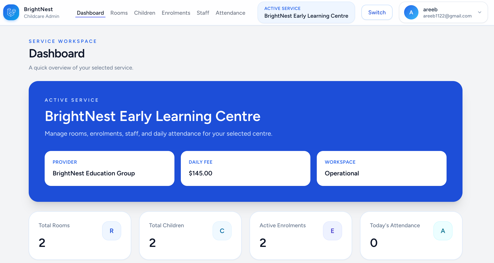
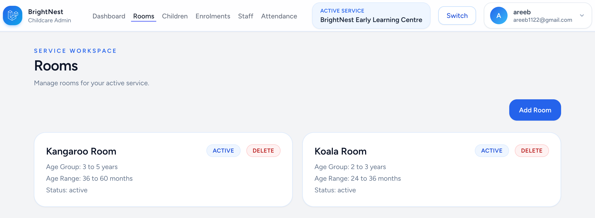
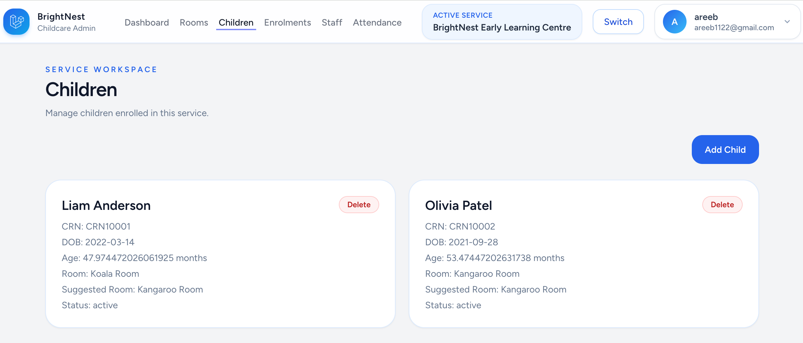

# BrightNest


## Childcare Administration Platform

BrightNest is a modern childcare administration platform designed to streamline operational workflows in early learning centres.

The system focuses on managing childcare services, rooms, children, and enrolments while supporting operational automation such as **age-based room allocation**.

The platform is built using **Laravel, Vue 3, and Tailwind CSS** and follows a modern SaaS-style administrative interface.

This project demonstrates full-stack development including backend architecture, API design, and component-based frontend UI.

---

# Application Screenshots

### Dashboard



### Rooms Management



### Children Management



---

# Key Features

### Authentication

Secure authentication using Laravel Breeze.

Features include:

• Login and logout  
• Session management  
• Protected application routes  
• User profile management  

---

### Multi Service Workspace

Users can manage multiple childcare services.

After login, the user selects an **active service workspace** and all data operations are scoped to that service.

This allows a single administrator to manage multiple childcare centres.

Features include:

• Active service switching  
• Session-based service context  
• Data isolation between services  

---

### Room Management

Administrators can create and manage childcare rooms within a service.

Room configuration includes age ranges to support automated child placement.

Room fields:

• Room name  
• Age group description  
• Minimum age in months  
• Maximum age in months  
• Status (active / inactive)

---

### Children Management

Children enrolled within a service can be created and managed.

Child records include key enrolment information.

Fields include:

• CRN (Child Reference Number)  
• First name  
• Last name  
• Date of birth  
• Status  

---

### Automatic Age-Based Room Suggestion

BrightNest includes logic to automatically suggest the appropriate room for a child.

The system:

1. Calculates the child’s age in months
2. Compares it against configured room age ranges
3. Suggests the most suitable room

This replicates real workflows used in childcare management systems.

---

# Technology Stack

Backend  
Laravel

Frontend  
Vue 3

Styling  
Tailwind CSS

Interactivity  
Alpine.js

Database  
MySQL

Authentication  
Laravel Breeze

---

# System Architecture

The application follows a modern full-stack architecture.

Laravel handles:

• Business logic  
• Database interactions  
• API endpoints  
• Authentication  

Vue manages:

• Component-based UI  
• Dynamic frontend rendering  

Alpine.js provides lightweight UI behaviour such as dropdowns and navigation interactions.

---

# Installation

Follow the steps below to run the project locally.

## Clone the Repository

```bash
git clone https://github.com/YOUR_USERNAME/brightnest.git
cd brightnest
```

## Install Backend Dependencies

```bash
composer install
```

## Install Frontend Dependencies

```bash
npm install
```

## Create Environment File

```bash
cp .env.example .env
```

## Generate Application Key

```bash
php artisan key:generate
```

## Configure Database

Open `.env` and update database configuration.

Example:

```
DB_CONNECTION=mysql
DB_HOST=127.0.0.1
DB_PORT=3306
DB_DATABASE=brightnest
DB_USERNAME=root
DB_PASSWORD=
```

## Run Database Migrations

```bash
php artisan migrate
```

## Start Laravel Server

```bash
php artisan serve
```

Application will run at:

```
http://127.0.0.1:8000
```

## Start Frontend Development Server

In another terminal:

```bash
npm run dev
```

---

# Current Modules

The platform currently includes:

Authentication  
Service workspace selection  
Room management  
Children management  
Age-based room suggestions  

---

# Future Roadmap

Planned features include:

Enrolments management  
Attendance tracking  
Staff management  
Child room transfers  
Room capacity management  
Compliance ratio monitoring  
Operational dashboards and analytics  

---

# Purpose of the Project

BrightNest was developed as a full-stack portfolio project demonstrating:

• Laravel backend development  
• API design  
• Vue component architecture  
• SaaS interface design  
• Business workflow modelling  

The project models real childcare operational workflows and can be extended into a full production platform.

---

# License

This project is provided for educational and portfolio purposes.
